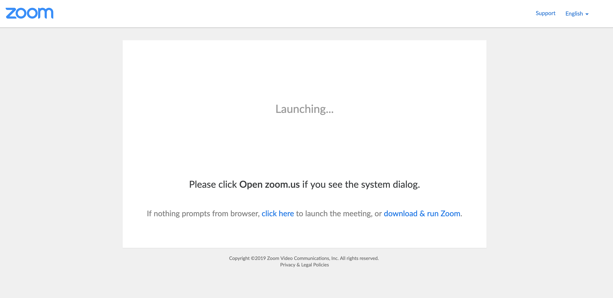

# ☠ Tab Sniper

Closes left-over Chrome tabs so you don't have to.

## Testing

1. `yarn`
2. Go to chrome://extensions/
3. Make sure "Developer Mode" is turned on
4. Click on "Load unpacked" 
5. Select this directory in finder
6. Reload the extension after making changes
